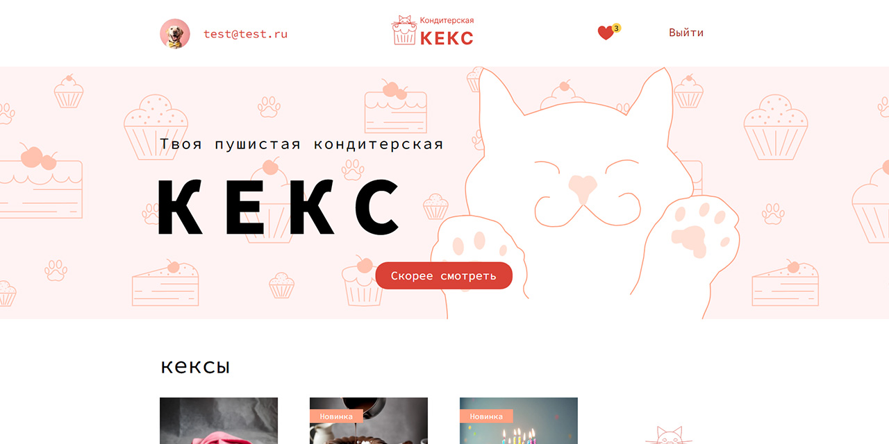

# Проект «Кондитерская Кекс» от [HTML Academy](https://htmlacademy.ru/)

Интернет-магазин десертов: тортов, пирожных. Пользователи сайта могут регистрироваться, добавлять товар в избранное, оставлять комментарии и оценивать вкусности.

Программирование: [Андрей Грачев](https://github.com/andreysgra/)

[Демо проекта](https://keks-sweetshop.vercel.app)

[Техническое задание](Specification.md)

## Используемый стек

React, TypeScript, React Router, Redux, Axios, Redux Toolkit.

## Как использовать

`npm install` – установка зависимостей.

`npm start` – запуск проекта в режиме разработки.

`npm run lint` – проверка проекта с помощью **ESLint**.

`npm run build` – финальная сборка проекта.

`npm run preview` – запуск финальной сборки проекта.
